# Bloom — Full-Stack App Flow

A walkthrough of how the app actually behaves today: what the user touches, what
crosses the wire, and where the wiring stops. Written from a read of
`backend/src`, `backend/prisma`, and `mobile/lib` on the `staging` branch.

- **Mobile:** Flutter 3.11 · Riverpod 3 · go_router 17 · Dio 5 · flutter_secure_storage
- **Backend:** NestJS · Prisma · PostgreSQL · Passport-JWT · Swagger at `/api`
- **Shape:** online-only. The app holds no business logic beyond UI state; the API owns auth, ownership, and streaks.

---

## 1. System overview

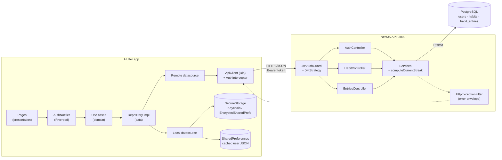

**Base URL resolution** (`core/constants/api_constants.dart`): `--dart-define=API_BASE_URL` wins;
otherwise Android emulator → `http://10.0.2.2:3000`, everything else → `http://localhost:3000`.

---

## 2. Clean-architecture layering (mobile)

Every feature folder repeats the same four-layer shape. Dependencies point inward
only; the DI file is the single place that knows concrete classes.

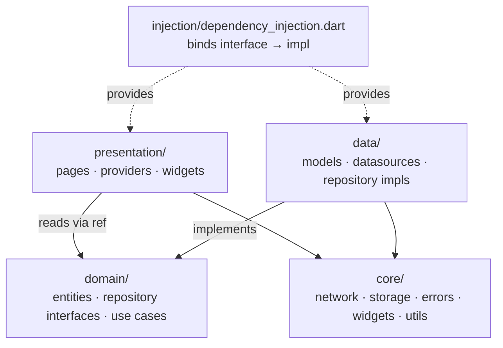

**Error translation happens exactly once.** Datasources throw `AppException`
(`ServerException`, `NetworkException`, `UnauthorizedException`,
`ValidationException`, `NotFoundException`, `CacheException`). The repository
catches them and returns a sealed `Result<T>` carrying a `Failure`. Presentation
code never sees a `try`/`catch` — it `switch`es over `Success` / `ResultError`.

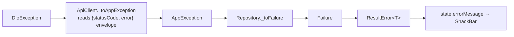

---

## 3. Startup and session restore

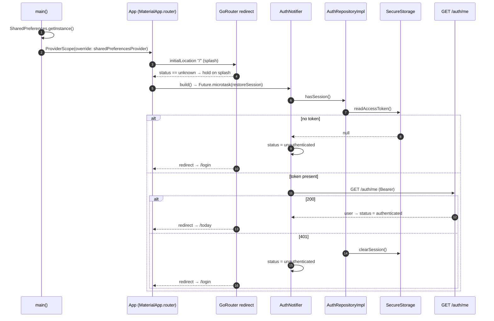

The router is rebuilt from a `ValueNotifier<AuthStatus>` fed by
`ref.listen(authNotifierProvider.select(...))`, so **no page ever decides
whether it may be shown** — `redirect` in `app_router.dart` does.

Redirect rules:

| Status | Location | Result |
|---|---|---|
| `unknown` | anything but `/` | → `/` (splash) |
| `unauthenticated` | public path (`/login`, `/register`, `/forgot-password`) | stay |
| `unauthenticated` | anything else, incl. `/` | → `/login` |
| `authenticated` | a public path | → `/today` |
| `authenticated` | private path | stay |

---

## 4. Screen flow

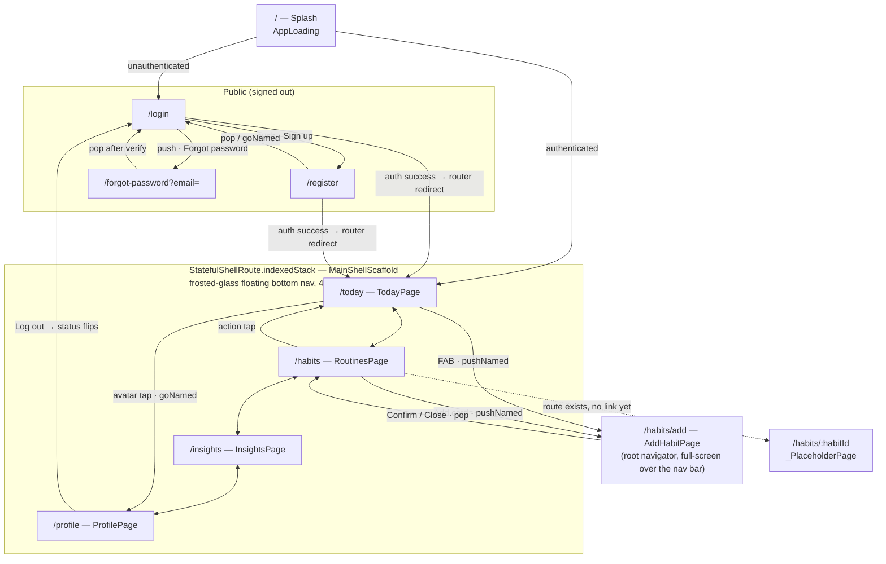

Tab state is preserved per branch (`indexedStack`); tapping the active tab
re-navigates to that branch's initial location.

---

## 5. Auth: login and register end to end

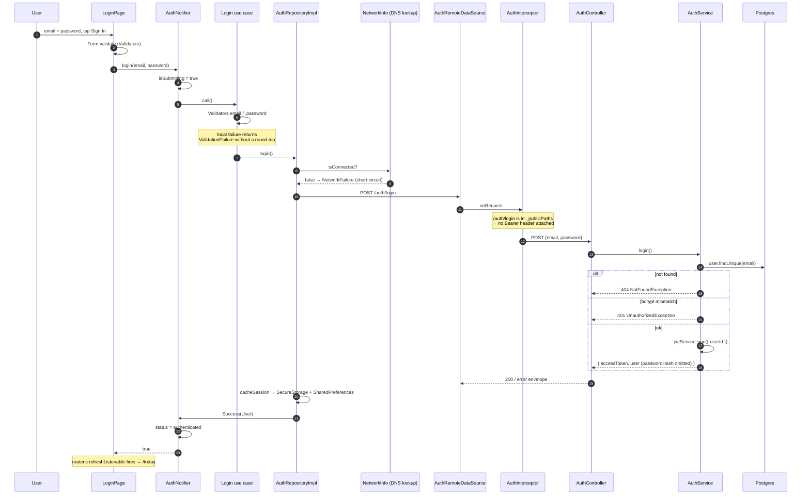

Register follows the same path against `POST /auth/register`
(409 on a duplicate email) and additionally checks `confirmPassword` client-side,
since the backend DTO has no such field.

**Token handling:** `AuthInterceptor` attaches
`Authorization: Bearer <token>` to every request whose path is not
`/auth/login` or `/auth/register`. On a 401/403 from a *non-public* path it
deletes the token — a 401 on login means "wrong password", not "expired
session", so the stored token is left alone there.

---

## 6. Habits and entries (backend contract)

All `/habits/**` routes sit behind `@UseGuards(JwtAuthGuard)` and resolve the
caller through the `@CurrentUser('id')` param decorator.

| Method | Path | Body / Query | Behaviour |
|---|---|---|---|
| `POST` | `/habits` | `{ name, color? }` (`color` must be hex) | creates for the current user |
| `GET` | `/habits` | `?date=YYYY-MM-DD` | active habits (`archivedAt: null`); with a date, each row is decorated with `doneToday` + `currentStreak` |
| `PATCH` | `/habits/:id` | `{ name?, color?, archived? }` | ownership-checked; `archived: true` stamps `archivedAt`, anything else clears it |
| `DELETE` | `/habits/:id` | — | ownership-checked hard delete (cascades entries) |
| `POST` | `/habits/:id/entries` | `{ date? }`, defaults to today | `upsert` on `@@unique([habitId, date])` — idempotent check-off |
| `GET` | `/habits/:id/entries` | `?from=&to=` | ownership-checked; returns `{ entries: Date[] }` ascending |
| `DELETE` | `/habits/:id/entries/:date` | — | un-check a day |

### Check-off round trip

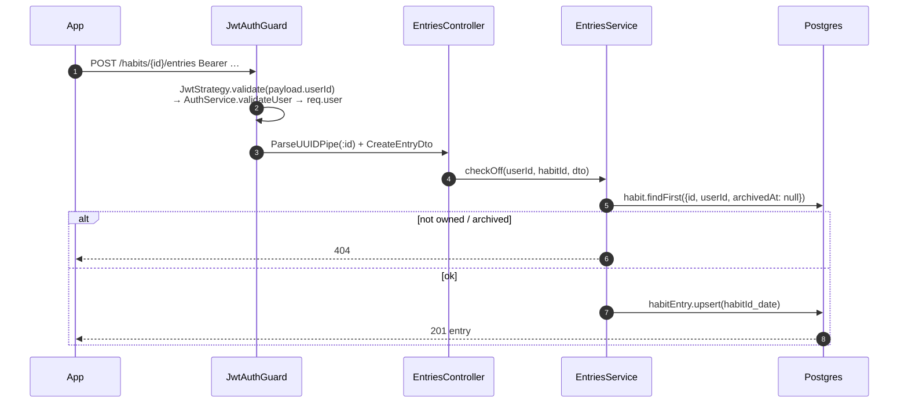

### Streak computation

`computeCurrentStreak` (`backend/src/utils/streak.ts`) is pure: it takes the
habit's entry dates plus a target day, builds a `Set` of `YYYY-MM-DD` strings,
and walks backwards one day at a time until a gap.

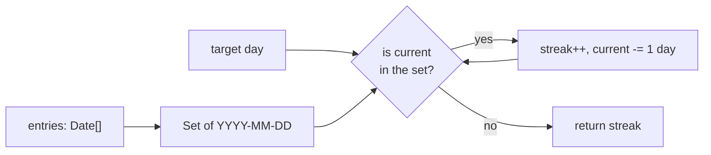

Streaks are **never stored** — there is nothing to keep in sync. Un-checking a
day is a row delete, and the next read recomputes.

### Error envelope

`HttpExceptionFilter` normalises every `HttpException` into a single shape, which
`ApiClient._parseErrorBody` reads back on the client:

```json
{ "statusCode": 401, "isSuccess": false, "timestamp": "…",
  "path": "/auth/login", "error": "Invalid credentials" }
```

`error` is a string for most failures and a **list** when class-validator rejects
a DTO — the client keeps the list as `ValidationFailure.errors` and shows the
first message.

---

## 7. Data model

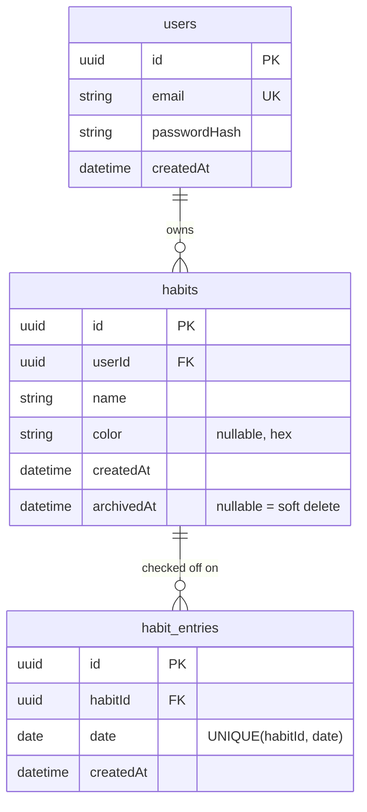

Both FKs are `onDelete: Cascade`. A check-off is just a row; archiving keeps
history, deleting discards it.

---

## 8. What is wired vs. what is UI-only

This is the most important thing to know before adding features. The Stitch
screens landed ahead of their data layers.

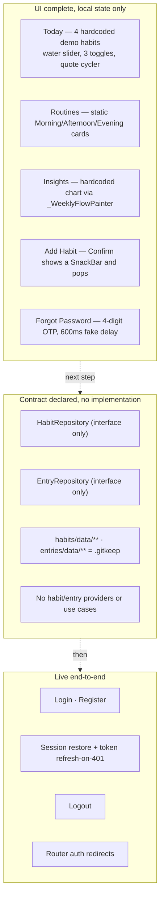

Concretely:

- **Fully wired:** `features/auth` has all four layers plus DI providers and use
  cases (`Login`, `Register`, `Logout`, `GetCurrentUser`). Only `email` reaches
  the UI from the server — `TodayPage` and `ProfilePage` derive a display name
  from `user?.email.split('@').first`, falling back to `'Sarah'`.
- **Domain declared, data empty:** `Habit` / `HabitEntry` entities and both
  repository interfaces exist and document the exact endpoints they map to, but
  `habits/data/` and `entries/data/` contain only `.gitkeep`. There are no
  models, datasources, impls, use cases, or providers, and nothing is registered
  in `dependency_injection.dart`.
- **Placeholder route:** `/habits/:habitId` renders `_PlaceholderPage`. No page
  links to it yet.
- **Backend-only:** the API already serves every habit/entry endpoint the mobile
  interfaces describe, so closing the gap is client-side work against a stable
  contract.

### The natural next slice

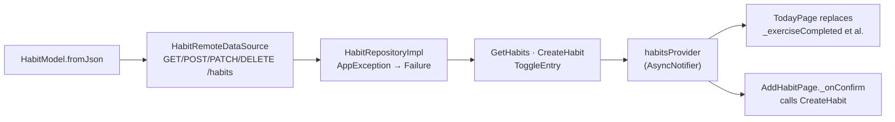

Mirror `features/auth` exactly — the layering, the `Result` handling, and the DI
registration are already proven there.

---

## 9. Rough edges found while walking the code

Not part of the flow as designed, but they will bite whoever wires the next
feature. Listed with the evidence, not as a fix list.

1. **Register issues a token the guard rejects.**
   `auth.service.ts` signs `{ id: user.id }` on register but `{ userId: user.id }`
   on login, while `JwtStrategy.validate` reads `payload.userId`. A token from
   `POST /auth/register` therefore resolves `userId: undefined` and fails the
   guard — a newly registered user is authenticated in the app's state but every
   subsequent call would 401.

2. **`GET /habits?date=` never reaches the service as a DTO.**
   `habit.controller.ts` declares `@Query('date') date?: GetHabitsDto`, which
   binds the raw string, but `habit.service.ts` reads `dateDto.date`. That is
   `undefined`, so `dayjs(undefined)` silently falls back to *now* rather than
   the requested day. Binding `@Query() query: GetHabitsDto` would match the
   service's expectation.

3. **`DELETE /habits/:id/entries/:date` looks up the wrong id and skips ownership.**
   The controller names the path param `entryId` but the route supplies the
   *habit* id, and `entriesService.deleteEntry` queries
   `habitEntry.findFirst({ id: entryId, date })` — so it will not match. It is
   also the only `/habits/**` handler that takes neither `@CurrentUser` nor an
   ownership check.

4. **Dates are stored as full ISO timestamps against a `DATE` column.**
   `standardizeDate` returns `dayjs(date).toISOString()`, and `TODAY` is
   evaluated **once at module load**, so a long-running process keeps handing out
   the boot day. Formatting to `YYYY-MM-DD` (as `formatDate` already does) would
   match the schema and the `@@unique([habitId, date])` intent.

5. **`updateHabits` spreads the whole existing row into the update payload,**
   including `id` and `createdAt`, and forces `archivedAt: null` whenever
   `archived` is falsy — so a plain rename un-archives the habit.

6. **`AuthInterceptor.onUnauthorized` is never supplied.** The DI layer
   constructs the interceptor without the callback, so a 401 clears the token but
   nothing tells the router; the redirect only happens on the next
   `getCurrentUser`. Wiring it (or listening to
   `AuthRepository.authStateChanges`, which is exposed but currently unread
   outside the repository) would close the loop.

7. **`ForgotPasswordPage` has no backend.** There is no
   `/auth/forgot-password` or `/auth/reset-password` on the server; the OTP
   screen verifies any 4 digits after a fixed delay.

---

## 10. File map

| Concern | Path |
|---|---|
| App entry / bootstrap | [mobile/lib/main.dart](../mobile/lib/main.dart) |
| Routing + redirects | [mobile/lib/app/router/app_router.dart](../mobile/lib/app/router/app_router.dart) |
| Route constants | [mobile/lib/app/router/route_names.dart](../mobile/lib/app/router/route_names.dart) |
| Tab shell / bottom nav | [mobile/lib/app/shell/main_shell_scaffold.dart](../mobile/lib/app/shell/main_shell_scaffold.dart) |
| Object graph | [mobile/lib/injection/dependency_injection.dart](../mobile/lib/injection/dependency_injection.dart) |
| Auth state machine | [mobile/lib/features/auth/presentation/providers/auth_provider.dart](../mobile/lib/features/auth/presentation/providers/auth_provider.dart) |
| Exception → Failure | [mobile/lib/features/auth/data/repositories/auth_repository_impl.dart](../mobile/lib/features/auth/data/repositories/auth_repository_impl.dart) |
| HTTP client | [mobile/lib/core/network/api_client.dart](../mobile/lib/core/network/api_client.dart) |
| Token attach / clear | [mobile/lib/core/network/interceptors/auth_interceptor.dart](../mobile/lib/core/network/interceptors/auth_interceptor.dart) |
| Endpoint constants | [mobile/lib/core/constants/api_constants.dart](../mobile/lib/core/constants/api_constants.dart) |
| Auth endpoints | [backend/src/auth/auth.controller.ts](../backend/src/auth/auth.controller.ts) |
| Habit endpoints | [backend/src/habit/habit.controller.ts](../backend/src/habit/habit.controller.ts) |
| Entry endpoints | [backend/src/entries/entries.controller.ts](../backend/src/entries/entries.controller.ts) |
| Streak rule | [backend/src/utils/streak.ts](../backend/src/utils/streak.ts) |
| Error envelope | [backend/src/common/filters/all-exceptions.filter.ts](../backend/src/common/filters/all-exceptions.filter.ts) |
| Schema | [backend/prisma/schema.prisma](../backend/prisma/schema.prisma) |
